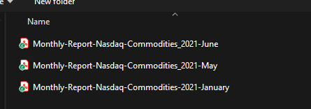
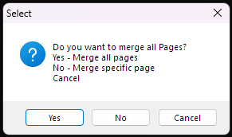

<p align="right"><a href="https://github.com/ojudz08/AutomationProjects/tree/main">Back To Main Page</a></p>


<!-- PROJECT LOGO -->
<br />
<div align="center">
<h1 align="center">PDF Merger</h1>
</div>


<!-- ABOUT PROJECT -->
### About

This is a project where it:
1. Merge all the pdf pages
2. Merge only the 1st pdf page

Raw Data Source is a pdf file type and Output Result is save as a pdf file type as well.

### What are the pre-requisites?

Run the command below in following order. Or you may simply run the run.bat which also contains the commands below.

```Python
python -m pip install -r requirements.txt
pyinstaller main.py --clean --onefile --name pdf_merger
python scripts/file_transfer.py
```


### Running the Script
1. Save your reports within __*reports*__ folder.

2. This will install all the necessary python libraries used.
   ```Python
   python -m pip install -r requirements.txt
   ```

3. Create an executable file pdf_merger.exe from the main.py
   ```Python
   pyinstaller main.py --clean --onefile --name pdf_merger
   ```

4. Move the created executable file in the current directory.
   ```Python
   python scripts/file_transfer.py
   ```


### How to use pdf_merger
1. After running the script above, you will see a **_pdf_merger_** application.

2. Once you run the application, it will prompt you to select the pdf files you want to merge.

   

3. After selecting the files to merge, select the options Yes, No or Cancel.

   

   - Select Yes if you want to merge all the pages on all the files selected. 
   - Select No if you want to merge specific pages only

     

   - Cancel if you want to cancel merging any pages.

4. Save the file.


<!-- CONTACT -->
### Disclaimer

This project was created using Windows, the run.bat will only work with Windows. Please contact Ojelle Rogero - ojelle.rogero@gmail.com for any questions with email subject "Github Parsing PDFs".
