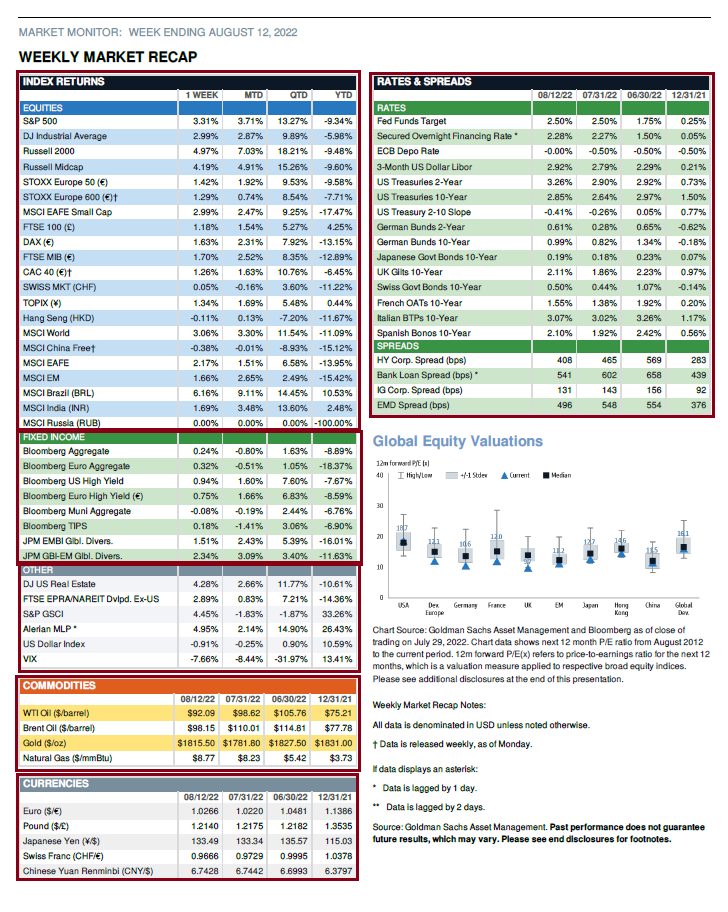
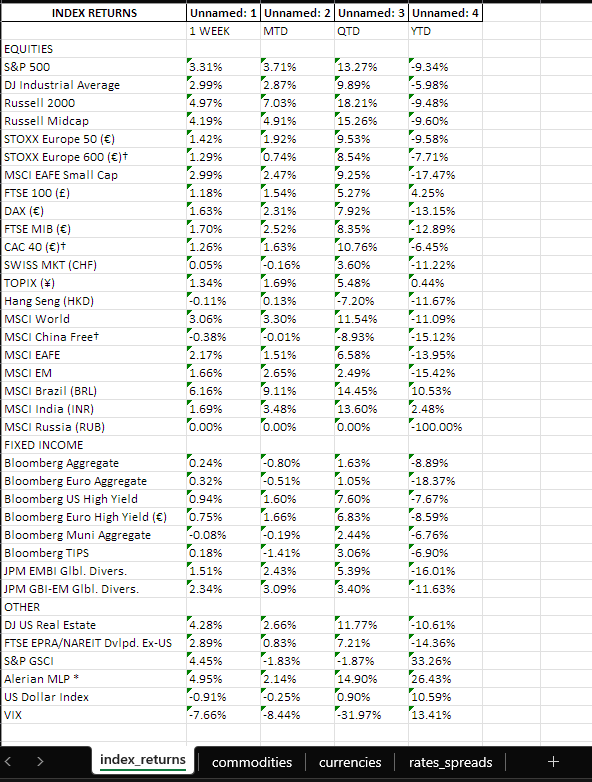
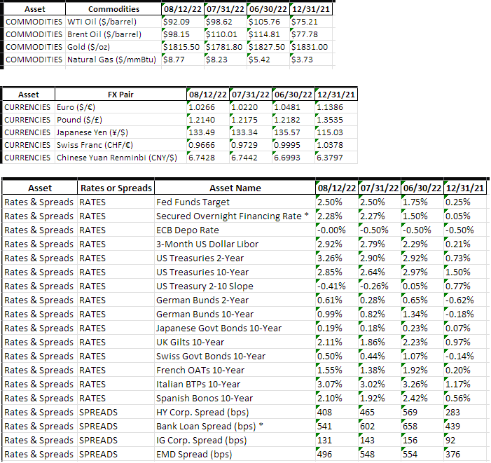
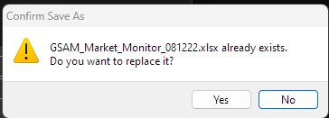
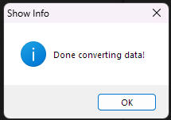

<p align="right"><a href="https://github.com/ojudz08/AutomationProjects/tree/main">Back To Main Page</a></p>


<!-- PROJECT LOGO -->
<br />
<div align="center">
<h1 align="center">Goldman Sachs Weekly Report PDF Parser</h1>
</div>


<!-- ABOUT PROJECT -->
### About Project

This is a simple pdf parser where it:
1. Parses the GSAM Assets from pdf into a summary 
   - Index Returns
   - Rates & Spreads
   - Commodities
   - Currencies
2. Save each asset type into a separate sheet


### What the report and output looks like

This is the page 3 of the GSAM report which contains the Weekly Market Recap showing different assets.




Once you've created the pdf_parser, it will iterate through all the tables, parses these tables and then save each table in separate worksheet.






### Requirements

1. Download jdk 8 from the archive downloads (this [link](https://www.oracle.com/in/java/technologies/javase/javase8-archive-downloads.html) )
2. Install the jdk 8.
3. Set your JAVA_HOME to the path where your jdk 8 is installed. 
   ```
   C:\Program Files\Java\jdk-1.8
   ```
4. Add these to your environment variable
   ```
   C:\Program Files\Java\jdk-1.8
   C:\Program Files\Java\jdk-1.8\bin
   ```
5. Download the tabula-jar dependency from this [link](https://github.com/tabulapdf/tabula-java/releases). Then save it within the JAVA_HOME\jre\lib

6. Add the path to your environment variable
   ```
   JAVA_HOME\jre\lib\{tabula-jar-dependency}
   ```

### What are the pre-requisites?

```Python version 3.11.9```

Run the command below in following order. 

```bat
python -m pip install -r requirements.txt
pyinstaller main.py --clean --onefile --name pdf_parser -y
python scripts/file_transfer.py
```

Or you may simply run the run.bat which also contains the commands below.

```bat
@echo off
echo Install requirements...
python -m pip install -r requirements.txt

echo Create pdf_parser.exe...
pyinstaller main.py --clean --onefile --name pdf_parser -y

python scripts/file_transfer.py
```

### Running the Script
1. Save your reports within __*reports*__ folder.

2. This will install all the necessary python libraries used.
   ```Python
   python -m pip install -r requirements.txt
   ```

3. Create an executable file pdf_parser.exe from the main.py
   ```Python
   pyinstaller main.py --clean --onefile --name pdf_parser -y
   ```

4. Move the created executable file in the current directory.
   ```Python
   python scripts/file_transfer.py
   ```

### How to use pdf_parser
1. After running the script above, you will see a **_pdf_parser_** application.

2. Once you run the application, it will prompt you to open the file.

   
   
3. Wait for the parsing to be completed.

   

4. Once parsing has been completed, it will prompt you to save the file.

   

   

   


<!-- CONTACT -->
### Disclaimer

This project was created using Windows, the run.bat will only work with Windows. Please contact Ojelle Rogero - ojelle.rogero@gmail.com for any questions with email subject "Github Parsing PDFs".
